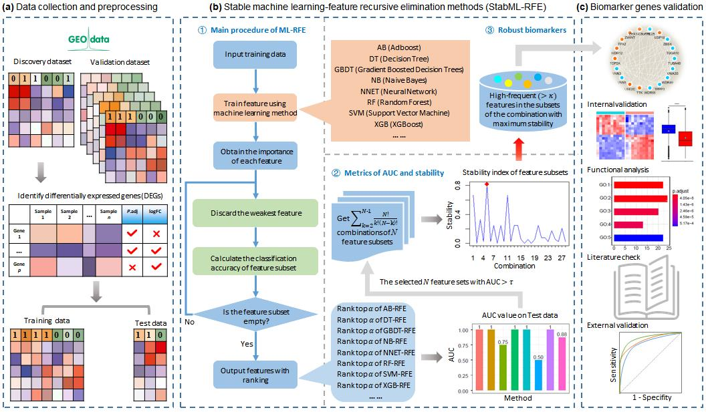

# [StabML-RFE (stable machine learning-recursive feature elimination method)](https://github.com/zpliulab/StabML-RFE)

In this work, we provide **a stable machine learning-recursive feature elimination method** named **StabML-RFE** for identifying **robust diagnostic biomarkers** of high-grade serous ovarian cancer (HGSOC) based on gene expression data. The successful identification of HGSOC biomarkers will be beneficial to reduce the risk of ovarian cancer among women for early disease detection. **Obviously, the proposed method of discovering biomarkers for HGSOC can be easily extended for other complex diseases**.

## StabML-RFE
<!--START_SECTION:news-->
* **StabML-RFE**: A method of stable machine learning-recursive feature elimination for identifying robust biomarker from gene expression data. 
* If you have any questions about **StabML-RFE**, please directly contact the corresponding author [Prof. Zhi-Ping Liu](https://scholar.google.com/citations?user=zkBXb_kAAAAJ&hl=zh-CN&oi=ao) with the E-mail: zpliu@sdu.edu.cn
<!--END_SECTION:news-->

## Citation
Li, Lingyu, Ching W K, Liu Z P. "**Robust biomarker screening from gene expression data by stable machine learning-recursive feature elimination methods**. [COMPUTATIONAL BIOLOGY AND CHEMISTRY](http://www.elsevier.com/wps/find/journaldescription.cws_home/627320/description#description), 2022, 100: 107747. [StabML-RFE paper website](https://www.sciencedirect.com/science/article/abs/pii/S147692712200127X)

@article{li2022robust,\\
  title={Robust biomarker screening from gene expression data by stable machine learning-recursive feature elimination methods},\\
  author={Li, Lingyu and Ching, Wai-Ki and Liu, Zhi-Ping},\\
  journal={Computational Biology and Chemistry},\\
  volume={100},\\
  pages={107747},\\
  year={2022},\\
  publisher={Elsevier}\\
}\\

## Data
<!--START_SECTION:news-->
* In the **Data**, **DataSPTB** and **DataHGSOC** files, we only give some necessary files by each R or Python program. 
* Some of these input files only give the first few lines, but this does not affect the results of the work (**StabML-RFE**).
* For convenience, we have used the new filename, but the R code still has the original filename. In other words, File **DataSPTB** is the file name  **DataTcgaGtex** in code**RforSPTB** , File **DataHGSOC** is the file name  **DataGEOTogather** in code**RforHGSOC**.
* Files **DataPython** and **DataPythonK**, they respectively contains the eight ranking lists obtained from eight ML-RFE methods and the optimal feature sets induced by the top-ranked  features of each method.
<!--END_SECTION:news-->

## R code for StabML-RFE  --  RforSPTB
The **serial number (1) (2) ... (11)** represents the order in which the program runs in our work.
<!--START_SECTION:news-->
* (1) DE_split_sptb.R  --  Divide the dataset and label the difference genes.
* (2) rfeSPTB.py ----  Feature selection using AB-RFE, DT-RFE, GBDT-RFE, NB-RFE, RF-RFE, SVM-RFE and XGB-RFE method.
* (3) rfe_nnetSPTB.R  --  Feature selection using NNET-RFE method.
* (4) RFE_ROC_SPTB.R  --  Firstly, Parameter alpha=0.04, select top-ranked alpha genes as optimal feature subset for each method, and save them in file DataPythonK. Secondly, perform internal validation, applying SVM classifier with linear baseline function to get the classification results, and save them in the file. Finally, screening by AUC value under parameter tau=0.75 for eight feature subsets, save them in the file DataPythonKauc.
* (5) stability_sptb4.R  --  Calculus stability index of the combinations of four subsets whose AUC>tau. Then select the features with Fren>k as Robust biomarkers, and save them in file fren4.csv.
* (6) feature_selectCompareSPTB.R  --  Perform internal and external validation. For the independent validation, use the file GSE73685new_bio. The feature data of GSE73685 is saved in the file DataCompare\\DataGEO, while the feature data of GSE59491 is saved in the file DataCompare\\DataTCGA. Last, investigate the classification AUC using SVM classifier.
* (7) Functional enrichment analysis using Metascape online database, the results can be found in the file MetascapeSPTB\\Enrichment_GO\\GO_AllLists.csv.
* (8) feature_studyKSPTB.R  --  Extract the biomarker genes from the discovery data for next DE analysis.  
* (9) DE_SPTB.R  --  Explore the differential expression situation of the selected biomarker genes.
* (10) Robust_SPTB.R  --  Calculate the robustness of 24 biomarkers selected by StabML-RFE method and other three ML-RFE methods. Especially, these three methods are contributing to the stable feature aggregation process.
* (11) PRSBox.R  --  Investigate the significance of the PRS index.
<!--END_SECTION:news-->

## R code for StabML-RFE  --  RforHGSOC
The **serial number (1) (2) ... (10)** represents the order in which the program runs in our work.
<!--START_SECTION:news-->
* (1) GSE69428_expr.R  --  Processing original data of GSE69284 and getting the (scale) data with corresponding labels. 
* (2) GSE69428_27651.R  --  Integrate the two datasets, make differential expression analysis, and split the new dataset into training and test datasets, the output file “matrix_DEtrain.txt” is used to input Python codes to conduct ML-RFE progression.    
* (3) rfeGEOtogather.py  --  Perform the seven ML-RFE methods with the random seed p = 2022, which is sued to keep the same result in each run. Thus the ranking files of all DE features are obtained (ranklist_SVMrfe.txt, ranklist_ABrfe, ranklist_RFrfe.txt, ranklist_DTrfe.txt, ranklist_GBDTrfe.txt, ranklist_XGBrfe.txt, ranklist_NBrfe.txt). 
* (4) rfe_nnetDEOtogather.R  --  Conduct NNET-RFE method and obtain “ranklist_NNETrfe.txt”.
* (5) RFE_ROC_GEOtogather.R  --  Selected the top-ranked 20 features of each list obtained from eight ML-RFE methods, take them as the optimal feature subsets, and test the classification results of each optimal feature subsets.
* (6) stability_GEOtogather6.R  --  Calculate the stability index of all combinations for quantifying the similarity of two or more feature sets, and identify the potential biomarkers. It proves the stability/robustness of the identified biomarkers selected by our subset identification strategy of different machine learning and feature selection methods.
* (7) feature_selectGEOCompareKall.R  --  Extract the expression value of the biomarkers from the external independent validation dataset. 
* (8) feature_studyGEOtogather.R  --  Extract the expression value of the biomarkers from the discovery dataset. 
* (9) corGEOtogather.R  --  It mainly makes internal validation including the differential analysis (Plot the differential box-plot and label the significance of the identified biomarkers on the discovery dataset), heatmap plot, the correlation of the biomarkers and the up/down-regulation, and the network of 18 biomarkers with correlation larger than 0.6.
* (10) Robust_HGSOC.R  --  calculate the robustness of HGSOC biomarkers selected by StabML-RFE method and other five alternative ML-RFE methods.
<!--END_SECTION:news-->

## Stability of Feature Selection Techniques for Bioinformatics Data
<!--START_SECTION:news-->
* [Feature selection is one of the most fundamental problems in data analysis, machine learning, and data mining](https://doi.org/10.1007/978-3-030-64583-0_19). Especially in domains where the chosen features are subject to further experimental research, the stability of the feature selection is very important. Stable feature selection means that the set of selected features is robust with respect to different data sets from the same data generating distribution.
* For data sets with similar features, the evaluation of feature selection stability is more difficult. An example of such data sets is gene expression data sets, where genes of the same biological processes are often highly positively correlated.  Here, stability measures that take into account the similarities between feature subsets are defined as **Hamming stability**.
<!--END_SECTION:news-->

## StabML-RFE (2022), Zhi-Ping Liu all rights reserved
This program package is supported by the copyright owners and coders "as is" and without warranty of any kind, express or implied, including, but not limited to, the implied warranties of merchantability and fitness for a particular purpose. In no event shall the copyright owner or contributor be liable for any direct, indirect, incidental, special, exemplary, or consequential damages (including, without limitation, procurement of substitute goods or services; loss of use, data, or profits; or business interruption), regardless of the theory of liability, whether in contract, strict liability or tort (including negligence or otherwise) for any use of the software, even if advised of the possibility of such damages.
